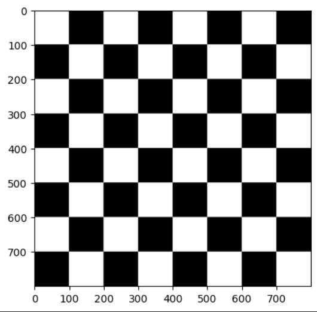
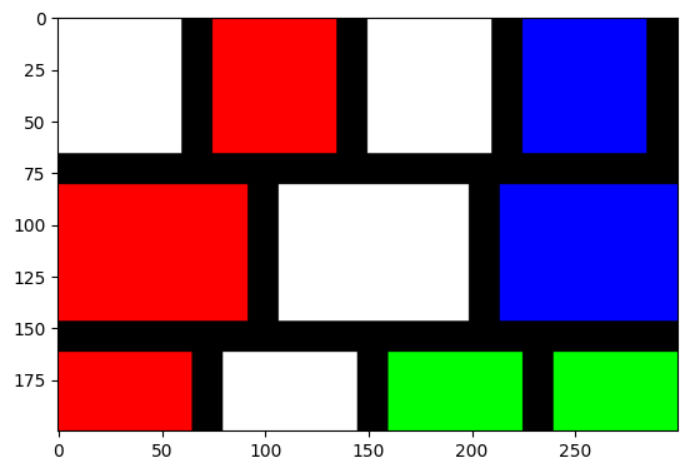
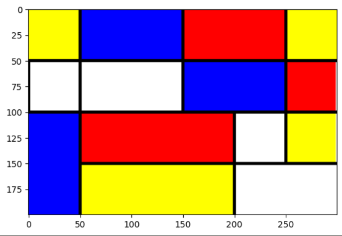
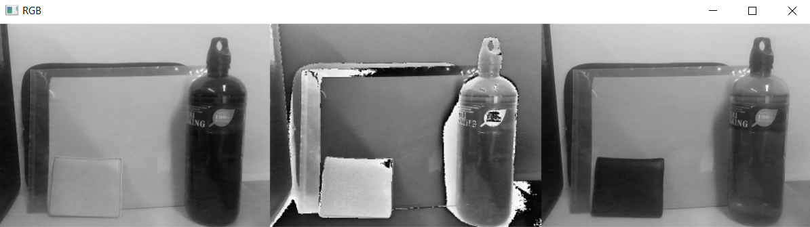
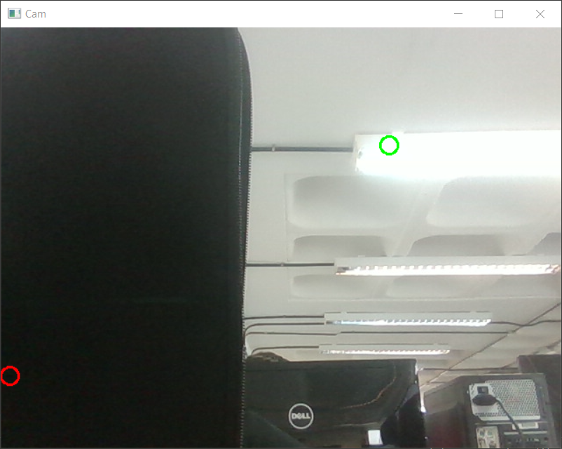
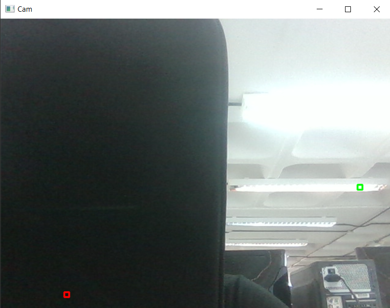
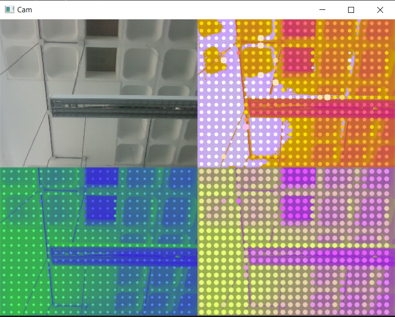

# Práctica 1. Primeros pasos con OpenCV

## Descripción
Creación de imágenes utilizando OpenCV y NumPy.
Efectos a tiempo real en cámara web.

## Tareas del Proyecto
- Tablero de ajedrez (800x800 píxeles)



- Imagen estilo [Mondrian](https://www3.gobiernodecanarias.org/medusa/ecoescuela/sa/2017/04/17/descubriendo-a-mondrian/)



- Imagen estilo [Mondrian](https://www3.gobiernodecanarias.org/medusa/ecoescuela/sa/2017/04/17/descubriendo-a-mondrian/) con OpenCV



- Modificación de forma libre los valores de un plano de la imagen



- Círculos en las posiciones del píxel más claro y oscuro de la imagen



- Círculos en las posiciones del píxel más claro y oscuro de la imagen: sobre la zona 8x8 más clara/oscura



- Propuesta propia de Pop Art



## Requisitos
### [Anaconda Prompt](https://www.anaconda.com/)
```
conda create --name VC_P1 python=3.11.5
conda create --name VC_P1 python=3.11.5
```
### OpenCV
```
pip install opencv-python
```
### Matplotlib
```
pip install matplotlib
```
### NumPy
```
pip install numpy
```
### ipykernel
```
conda install -n VC_P1 ipykernel --update-deps --force-reinstall
```

## Bibliografía
[Creating 'Pop Art' using OpenCV and Python](https://www.analytics-link.com/post/2019/07/11/creating-pop-art-using-opencv-and-python) - Andrew Jones, 2019

[OpenCV documentation](https://docs.opencv.org/4.x/d2/de8/group__core__array.html)

## Autoría
[Sara Expósito Suárez](https://github.com/SaraE5)

[Alejandro Padrón Ossorio](https://github.com/apadoss)
